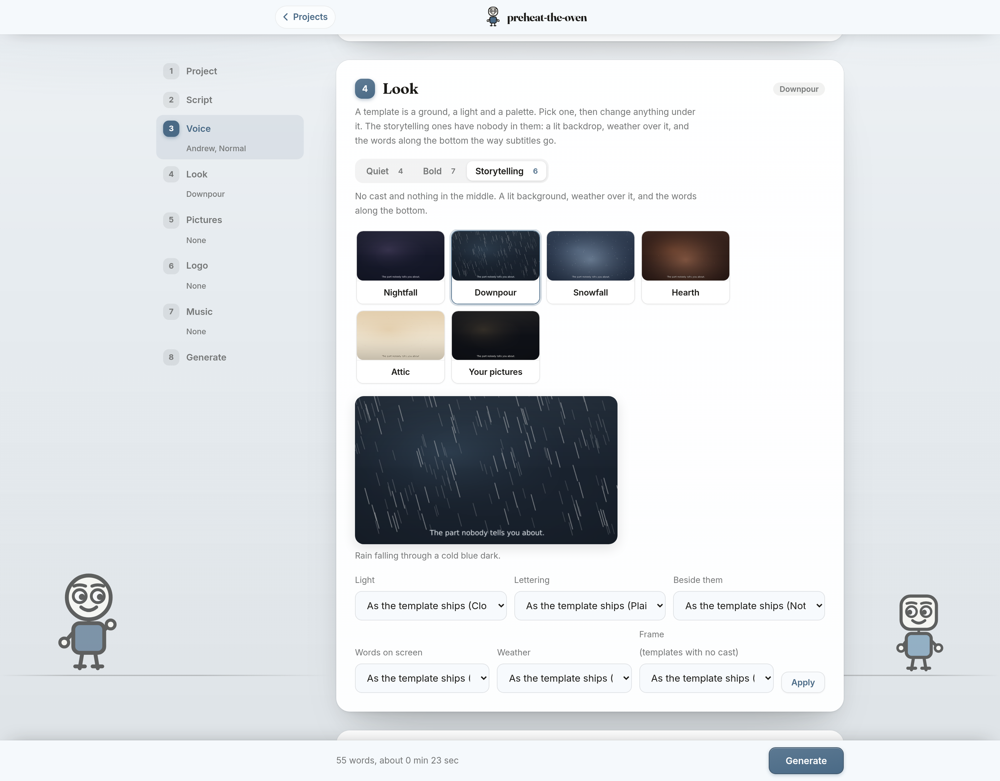
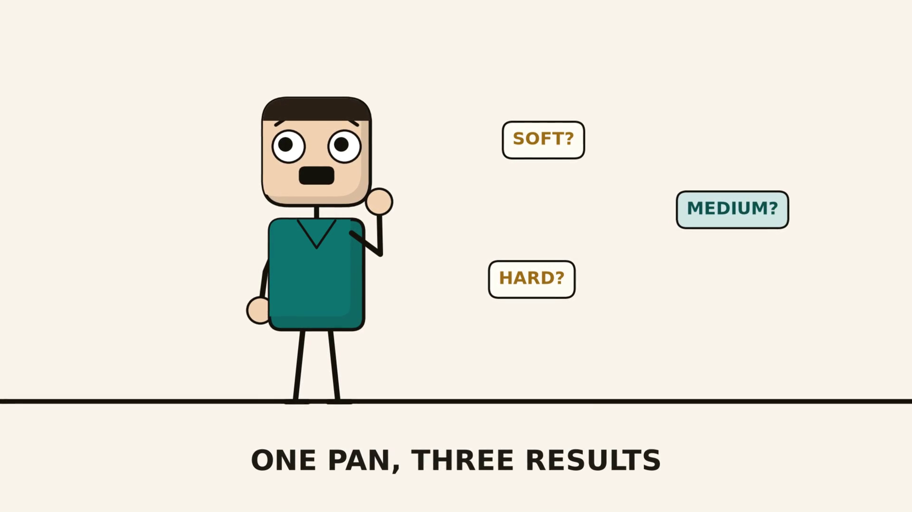

# script to vid

Write a script. Get back a narrated video with visuals, subtitles, your logo
and music. Characters blink and their mouths move in time with the narration.
Finished videos can be joined into one, so a long script can be made in parts.
Runs on your own computer, free, no editing software.

## Install

**Windows.** Press the Windows key, type `powershell`, open it, then paste
this and press Enter:

```
irm https://raw.githubusercontent.com/ChimaOzonwoye/script-to-vid/main/install.ps1 | iex
```

**Mac.** Press Command and Space, type `terminal`, open it, then paste this
and press Enter:

```
curl -fsSL https://raw.githubusercontent.com/ChimaOzonwoye/script-to-vid/main/install.sh | bash
```

That is the whole install. It checks for Python and tells you where to get it
if you need it, downloads everything including the video engine, and opens the
app in your browser when it is finished. The first run takes a few minutes.
After that there is a **script to vid** shortcut on your Desktop.

If you would rather not paste something you have not read, open the link in
your browser first and read it. Or paste it into an AI chatbot and ask what it
does before you run it. Piping a script from the internet into your shell is a
fair thing to be careful about.

<details>
<summary>Prefer to download it yourself?</summary>

Click the green **Code** button above, then **Download ZIP**, and unzip it.
Then on Windows double-click `install-windows.bat`, or on a Mac open Terminal
in that folder and run `./install.sh`. Same result, more steps.

</details>





## Why this exists

Explaining something well is not just a video. It is narration, visuals,
captions, branding and an edit. Paying people for that costs money. AI video
tools charge per render. If you have something worth explaining and no budget,
that is usually where it ends.

This does the whole production on your own computer for free, so money is not
the reason it never gets made.

This is a first step, not a finish line. It gets you making and publishing
now, with what you already have. When you can afford better tools, use them.
Not having the resources should not be the reason you never start.

## Why there is no AI video in this

Generating video or images with a model needs a graphics card most computers
do not have. Paying a service to do it instead costs money per video. Either
way, the requirement is the thing that stops people.

So this draws everything from code. It runs on an ordinary laptop, it costs
nothing, and it never gets slower or more expensive the more you make.

## Use

Your first project opens with a short example script already in it. Press
**Generate** and watch a real video come out before you write anything of your
own.

After that: write your script, choose a voice, pick a look, add a logo and
music if you want them, then Generate. Download the MP4 and the subtitle file
when it finishes. Each video is a project, and duplicating one starts the next
week's video with the same settings.

Twelve narration voices are included across American, British, Australian,
Indian and Nigerian accents, and you can hear each one before you choose. The
speed has three settings.

Re-running is cheap. Editing one line only remakes that line. Changing the
look reuses the whole voiceover. Changing the voice remakes the narration and
nothing else.

## Joining videos

**Join videos** on the front page puts finished videos together into one, in
whatever order you tick them.

It is there for two reasons. A long script may be more than a given computer
can render in one sitting, so make it as two or three projects and join the
parts at the end. And a joiner is useful on its own, so it takes video files
from anywhere, not just ones made here.

Videos made by this app are never re-encoded, because they already share one
shape, so joining them takes seconds however long they are. A video from
somewhere else is converted to that shape first, which takes minutes, and the
page says which of the two is about to happen before you start. Anything of a
different size is letterboxed rather than stretched, and a clip with no sound
has silence put in, because otherwise the audio would stop at that point and
never come back.

## The script format

**No special formatting is required.** Paste your script, exactly the words
you want spoken, and press Generate. Blank lines separate it into beats.

```
Boiling an egg sounds like the simplest thing in the world, and most people
still get it slightly wrong.

Start with eggs straight from the fridge, and a pan deep enough to cover them
by about an inch of water.
```

Scripts written elsewhere usually carry things nobody wants read aloud:
`[Scene 1 - man at a desk]`, a bare `0:00 - 0:15`, `Narration:` down the left
margin. Those are left out, labels like `Narration:` and `Visual:` are used
for what they describe, and every line that was left out is listed above the
Generate button with a button to put it back. Nothing is dropped silently.

### Optional formatting

If you want more control, two characters do it. `#` starts a chapter card and
`>` is a visual direction.

```
# How to boil an egg

> character: happy, cheer
> caption: Cover them by an inch

Start with eggs straight from the fridge.

> bubbles: soft?, medium?, hard?

Six minutes gives you a runny yolk.
```

Directions include `character`, `duo`, `bubbles`, `split`, `chart`, `gauge`,
`timeline`, `growth`, `jars`, `terms`, `callout`, `quiet`, `recap`, `title`,
`sweep`, `outro`, and the modifiers `caption`, `sub`, `prop` and `scene`.
Anything the parser does not recognise becomes narration, never an error.

`> scene: kitchen` puts a character in a room. The settings are `classroom`,
`office`, `kitchen`, `living room`, `street` and `plain`, and `plain` is what
you get if you never ask.

The example a new project opens with is in `example-script.txt`.

## Licence

You can use this for anything, including commercially. The videos you make are
yours, and nobody has a claim on them.

The bundled music and the character drawings are original work that ships with
this project, with no rights held by anyone else, so a video using them is safe
to put on a monetised channel. No attribution is required.

The code is MIT licensed. See [LICENSE](LICENSE).

## Contributing

Contributions are welcome. Bugs, new scene layouts, new props, more voices,
better installers, anything. Open an issue or send a pull request.

The one rule: this has to stay usable by someone who has never opened a
terminal. A change that adds a setup step, a config file to edit, or an error
message only a developer can read is not an improvement here, however good the
code is.
